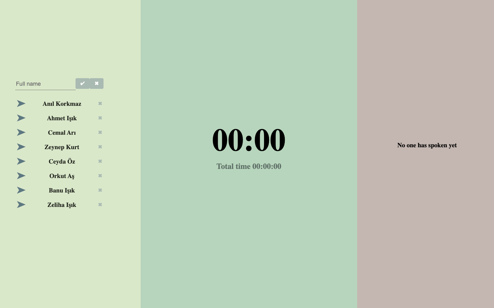
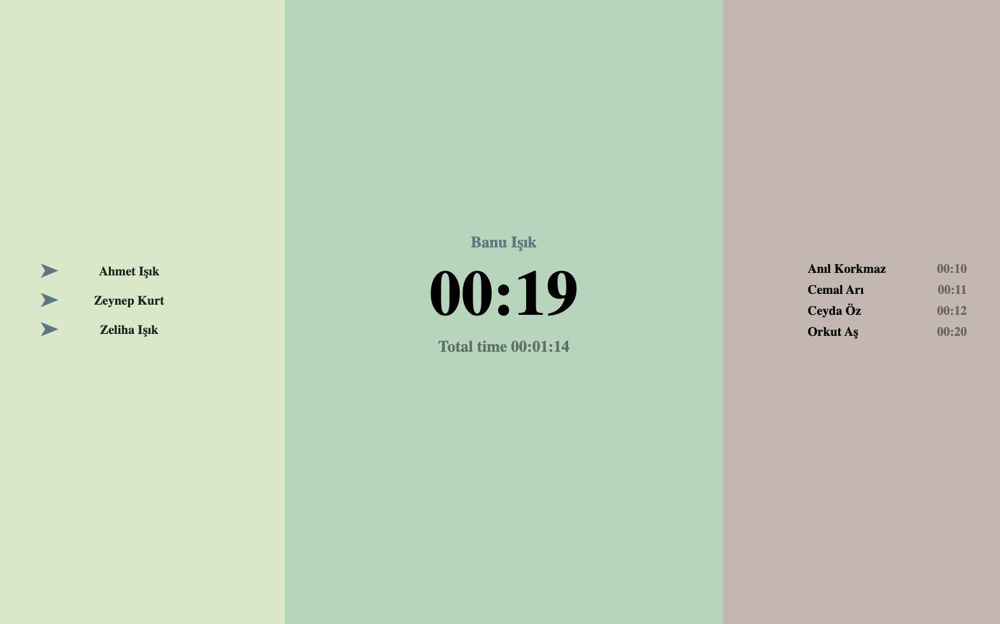

# Readme
This application is a React project that manages daily meetings without requiring any database or backend connection, storing the list of participants in local storage.

## Feautes

- It keeps track of the list of attendees.
- The duration of each speaker's speech can be observed.
- The total duration is visible.
- After a person speaks, it can determine who hasn't spoken yet in order to give them a turn.

## Update 
- Deactivate user for a session with 💤

## Test

https://anilkorkmaz.github.io/daily-meeting-management

### `npm run build`

Builds the app for production to the `build` folder.\
It correctly bundles React in production mode and optimizes the build for the best performance.

